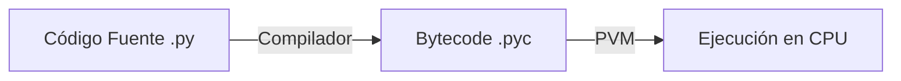

# Compilación vs Interpretación en Python

Para entender el bytecode, primero debemos entender cómo Python ejecuta tu código en comparación con otros lenguajes.

## 1. Los dos extremos

### Lenguajes Compilados (ej. C, C++, Rust)
El código fuente se traduce **directamente a código máquina** (binario) que el procesador entiende.
*   **Proceso:** `Código Fuente (.c)` -> `Compilador` -> `Binario Ejecutable (.exe)`
*   **Ventaja:** Muy rápido.
*   **Desventaja:** Debes recompilar para cada sistema operativo (Windows, Linux, Mac).

### Lenguajes Interpretados (ej. Bash, JavaScript antiguo)
Un programa "intérprete" lee el código fuente línea por línea y lo ejecuta al momento.
*   **Proceso:** `Código Fuente` -> `Intérprete` -> `Ejecución`
*   **Ventaja:** Muy flexible y portátil.
*   **Desventaja:** Generalmente más lento, ya que debe "traducir" cada línea cada vez que la ve.

## 2. El enfoque híbrido de Python

Python no es puramente interpretado ni puramente compilado en el sentido tradicional. Usa un enfoque intermedio:

1.  **Compilación:** Cuando ejecutas un script, Python primero lo compila a **Bytecode**.
2.  **Interpretación:** Luego, la **Máquina Virtual de Python (PVM)** lee ese bytecode y lo ejecuta.

### ¿Por qué este enfoque?
*   **Portabilidad:** El bytecode es independiente de la plataforma. El mismo archivo `.pyc` puede funcionar en Windows o Linux, siempre que tengan la misma versión de la PVM.
*   **Velocidad de inicio:** Si el código no ha cambiado, Python carga directamente el `.pyc` ya compilado, saltándose el paso de análisis del texto fuente.

## 3. La Máquina Virtual de Python (PVM)

La PVM es un programa (escrito generalmente en C) que simula ser una CPU.
*   Tu CPU real entiende instrucciones como "mueve datos al registro AX".
*   La PVM entiende instrucciones como "carga esta variable en la pila" (`LOAD_FAST`).

El bytecode es simplemente el "lenguaje máquina" de esta CPU virtual.
